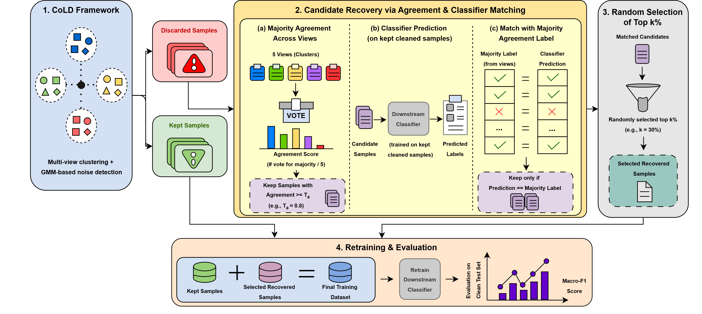

# CoLD++: Improving Collaborative Label Denoising Framework for Network Intrusion Detection using Label Correction

This repository contains **CoLD++**, an enhanced implementation of the **CoLD (Collaborative Label Denoising)** framework for learning under noisy labels in Network Intrusion Detection Systems (NIDS).

Unlike the original CoLD framework, which permanently removes samples identified as noisy, **CoLD++ introduces a selective label correction and recovery mechanism**. The proposed framework recovers reliable discarded samples using collaborative agreement and classifier-based verification, assigns corrected labels, and reintegrates them into the training set while preserving the original collaborative denoising pipeline.

---

# Framework Overview

<p align="center">
  
</p>

<p align="center">
<b>Figure 1.</b> Overview of the proposed CoLD++ framework.
</p>

---

# Main Enhancement

The proposed **CoLD++** framework extends the original CoLD recovery stage through **Label Correction instead of Sample Removal**.

The recovery pipeline consists of four stages:

### 1. Multi-view Agreement

Samples discarded by the original CoLD purification stage are revisited. Only samples receiving unanimous agreement across the Global View and all Local Views are considered recovery candidates.

### 2. Classifier Verification

A downstream classifier trained using the purified samples predicts labels for all recovery candidates.

### 3. Label Correction

A candidate sample is recovered only when the classifier prediction matches the collaborative agreement label. This minimizes the risk of introducing incorrectly recovered samples.

### 4. Selective Sample Reintegration

Recovered samples are assigned corrected labels and merged back into the purified training set. The downstream classifier is then retrained using both purified and recovered samples.

This strategy preserves informative training samples that would otherwise be discarded, leading to improved downstream intrusion detection performance.

---

# Additional Experimental Analysis

Apart from the proposed CoLD++ framework, the repository also includes two additional experimental studies:

- **Diversified Sample Selection**
- **Adaptive Maximum Probability Threshold**

These experiments are provided for analysis purposes only and are **not part of the proposed CoLD++ framework**.

---

# Repository Structure

```text
CoLD_Enhancement/
│
├── config/
│   └── default.yaml
│
├── figures/
│   └── CoLD++_figure.png
│
├── scripts/
│   ├── classify.py
│   ├── clustering.py
│   ├── config.py
│   ├── data.py
│   ├── denoise.py
│   ├── encoder.py
│   ├── feature_reorder.py
│   ├── losses.py
│   ├── metrics.py
│   ├── model.py
│   ├── pipeline.py
│   ├── recovery.py
│   ├── reliability.py
│   └── utils.py
│
├── prepare_data.py
├── main.py
├── requirements.txt
└── README.md
```

---

# Dataset

Experiments were conducted on the following dataset:

- **MALTLS-22**

The processed dataset should follow the same directory structure as the original CoLD implementation.

```text
data/
    MALTLS-22/
        X_train.npy
        y_train.npy
        X_test.npy
        y_test.npy
```

---

# Installation

Clone the repository

```bash
git clone https://github.com/jinalpatel1210/CoLD_Enhancement.git
cd CoLD_Enhancement
```

Install the required dependencies

```bash
pip install -r requirements.txt
```

---

# Running the Code

Execute the complete pipeline using

```bash
python main.py
```

Configuration parameters can be modified through

```text
config/default.yaml
```

---

# Experimental Results

The proposed CoLD++ framework was evaluated under both **symmetric** and **asymmetric** label noise settings on the **MALTLS-22** dataset.

The selective label recovery strategy consistently improves or maintains the downstream Macro-F1 score by preserving informative training samples that would otherwise be discarded by the original CoLD framework.

The repository also includes two additional experimental analyses:

- Diversified Sample Selection
- Adaptive Maximum Probability Threshold

---

# Citation

If you use this repository, please cite the original CoLD paper.

```bibtex
@inproceedings{yang2026cold,
  title={CoLD: Collaborative Label Denoising Framework for Network Intrusion Detection},
  author={Yang, Shuo and others},
  booktitle={Proceedings of the Network and Distributed System Security Symposium (NDSS)},
  year={2026}
}
```

---

# Acknowledgements

This work is built upon the original **CoLD** framework proposed by the authors of the NDSS 2026 paper.

We sincerely acknowledge the original authors for making their implementation publicly available.

The proposed **CoLD++** framework extends the original work through a selective label recovery mechanism that performs label correction instead of permanently removing noisy samples.

---

# License

This project follows the same license as the original CoLD repository.
